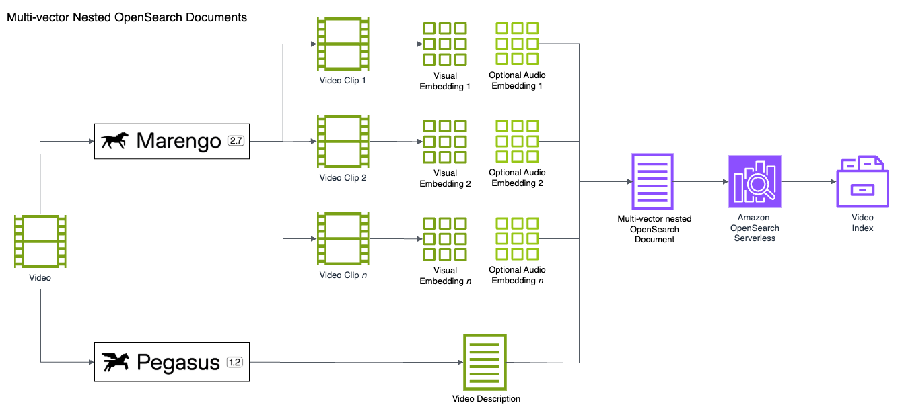

# Multi-Vector Semantic Search: Advanced Video Search with TwelveLabs and Amazon OpenSearch

Code for the Medium blog post, [Multi-Vector Semantic Search: Advanced Video Search with TwelveLabs and Amazon OpenSearch](https://garystafford.medium.com/multi-vector-semantic-search-advanced-video-search-with-twelve-labs-and-amazon-opensearch-7b81ba52c373), also on [LinkedIn](https://www.linkedin.com/pulse/multi-vector-semantic-search-advanced-video-twelve-labs-gary-stafford-dmjoc/?trackingId=H5lUSIgrTv6eBGlnmr%2Fo6g%3D%3D). How TwelveLabs AI Models and Amazon OpenSearch Serverless enable multi-vector semantic and hybrid search for video content.



## Repository Structure

```text
.
├── documents/
│   ├── pexels/                             # OpenSearch documents
├── output/
│   ├── pexels/                             # Generated analyses and embeddings
├── videos/
│   ├── pexels/                             # Source videos
├── sample_document.json                    # Sample OpenSearch document
├── sample_text_embedding.json              # Sample dense vector embedding from text
├── sample_image.jpg                        # Sample image to create embedding from
├── docker-compose.yml                      # OpenSearch Docker Swarm file
└── twelve-labs-demo-nested-public.ipynb    # All code for blog post demonstration
```

## Usage Instructions

### Prerequisites

- Python 3.12+
- AWS credentials
- Amazon OpenSearch Serverless collection
- TwelveLabs API key

Have the following environment variables ready for Notebook:

```bash
# AWS Credentials (or modify code to use alternative authentication method)
AWS_REGION=<Your AWS Region>
AWS_ACCESS_KEY_ID=<Your AWS Access Key ID>
AWS_SECRET_ACCESS_KEY=<Your AWS Secret Access Key>
AWS_SESSION_TOKEN=<Your AWS Session Token>

# TwelveLabs' API Key
TL_API_KEY=<Your TL API Key>

# OpenSearch endpoint without 'http://' prefix
OPENSEARCH_ENDPOINT=<Your OpenSearch Endpoint>
```

### Installation

Clone the repository and create the required directories:

```bash
git clone https://github.com/garystafford/twelve-labs-opensearch-demo.git
cd twelve-labs-opensearch-demo
```

Mac:

```bash
mkdir -p "videos/pexels"
mkdir -p "output/pexels"
mkdir -p "documents/pexels"
```

Windows:

```bat
mkdir "videos\pexels"
mkdir "output\pexels"
mkdir "documents\pexels"
```

Create a Python virtual environment for the Jupyter Notebook:

Mac:

```bash
python -m pip install virtualenv -Uq
python -m venv .venv
source .venv/bin/activate
```

Windows:

```bat
python -m venv .venv
.venv\Scripts\activate
```

### Run the Code

Access the Jupyter Notebook for all code:

[twelve-labs-demo-nested-public.ipynb](twelve-labs-demo-nested-public.ipynb)

## Alternative: Running OpenSearch in Docker

As an alternative to AWS, you can run OpenSearch locally using Docker. This is insecure and intended only for development environments.

Mac:

```bash
docker swarm init

SWARM_ID=$(docker node ls --format "{{.ID}}")
docker stack deploy -c docker-compose.yml $SWARM_ID

docker service ls
```

Windows:

```bat
docker swarm init

for /f "delims=" %x in ('docker node ls --format "{{.ID}}"') do set SWARM_ID=%x
docker stack deploy -c docker-compose.yml %SWARM_ID%

docker service ls
```

In the Jupyter Notebook, update the `os_client` to use the Docker-based OpenSearch instance:

Existing Amazon OpenSearch Client:

```python
os_client = OpenSearch(
    hosts=[{"host": os_host, "port": 443}],
    http_auth=auth,
    use_ssl=True,
    verify_certs=True,
    connection_class=RequestsHttpConnection,
    pool_maxsize=20,
)
```

Revised Docker-based OpenSearch Client:

```python
import warnings

# Suppress warnings related to unverified HTTPS requests and SSL connections
warnings.filterwarnings('ignore', message='Unverified HTTPS request')
warnings.filterwarnings('ignore', message='Connecting to https://localhost:9200 using SSL')

os_client = OpenSearch(
    hosts=[{"host": os_host, "port": 9200}],
    http_auth=("admin", "OpenSearch123"),
    use_ssl=True,
    verify_certs=False,
)
```

## Basic OpenSearch Command

```text
GET pexels-video-index/_settings

GET pexels-video-index/_count

GET pexels-video-index/_search
{
  "query": {
    "match": {
      "system_metadata.filename": "15111760-sd_640_360_25fps.mp4"
    }
  },
  "size": 1
}
```

---

_The contents of this repository represent my viewpoints and not those of my past or current employers, including Amazon Web Services (AWS). All third-party libraries, modules, plugins, and SDKs are the property of their respective owners._
